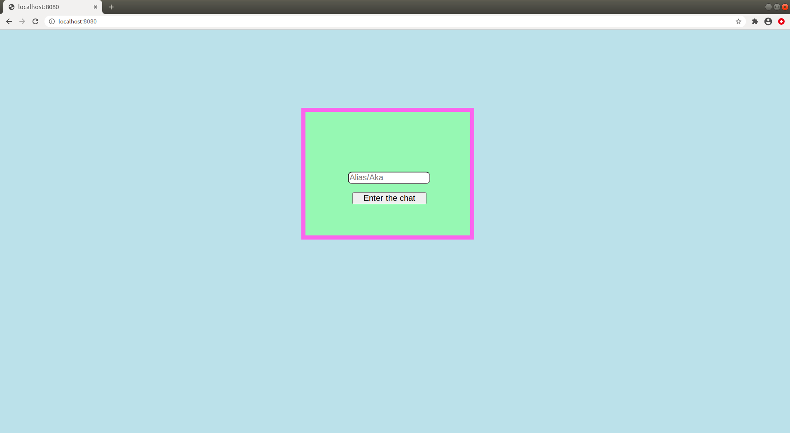

Simple Chat application without any JS, for tor(Darknet) 
===

Prerequisties
==

**php 5.0 or greater**

**Mysql**	

Setup
=

**Start with executing the table_creation.php file, it will add necessary tables to your database, don't forget to change the name of database,username and password.**

**As this application is for tor that's why it doesn't use any javasvript as most of the time users on darknet disable javascript for security reasons ,but you can still host in on surface web, but their are many other chat application for that and they use javascipt which makes them look and work better.**

**people mostly use Nginx to host their website on darknet. In order to unable PHP on your nginx server paste this code in your nginx configuration file, don't forget to restart your server after that.**
```

server {
listen 127.0.0.1:8080;
server_name localhost;
root /var/www;
index index.php;

location ~ \.php$ {
           include snippets/fastcgi-php.conf;
           fastcgi_pass unix:/var/run/php/php7.2-fpm.sock;
fastcgi_param SCRIPT_FILENAME $document_root/$fastcgi_script_name;
        }
location ~ /\.ht {
      deny all;
        }
}
```
**or if you are using apache, it's simple to turn on the PHP**



***If you have any questions mail me at aakarshan7raj@gmail.com***
